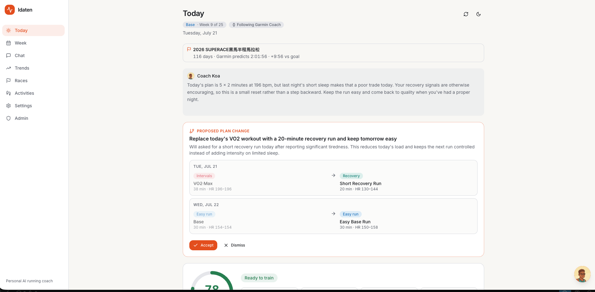
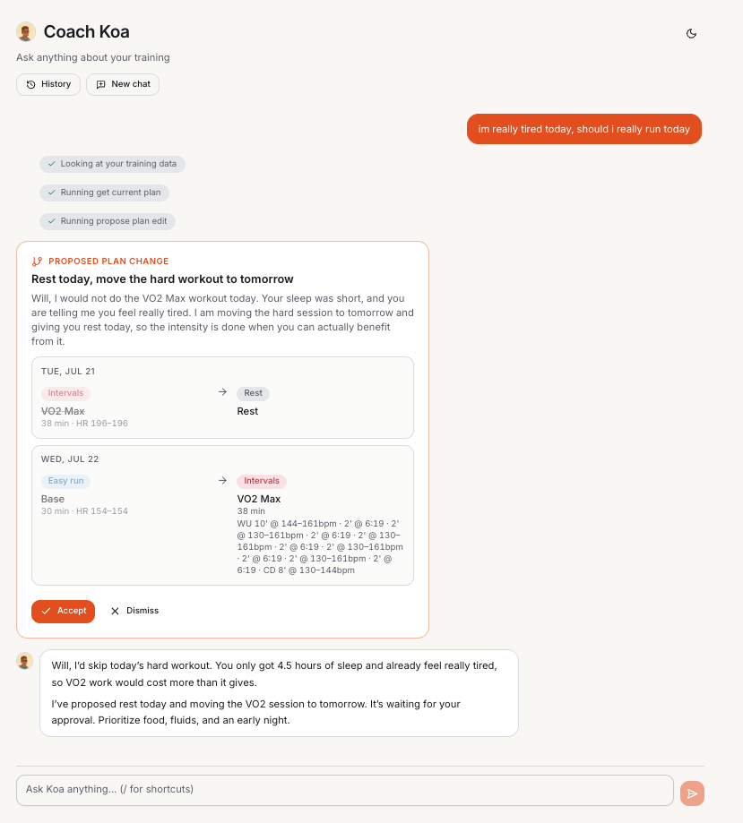
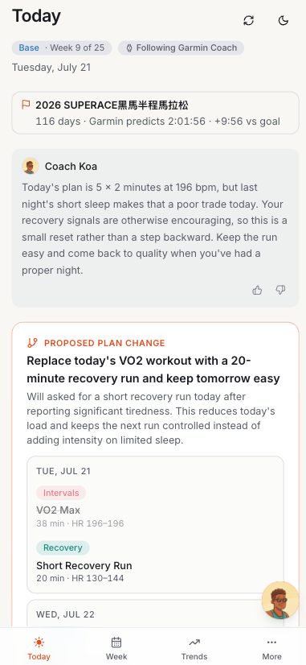

# Idaten - personal AI running coach

Syncs your Garmin data daily, keeps a rolling 7-day training plan toward your race adjusted for sleep / HRV / training load, pushes structured workouts to your watch, and lets you chat with a coach that can read your data and propose plan changes (with a diff you approve).

It runs in production for a small household of real athletes - behind a test gate, a Cloudflare tunnel, and encrypted credentials - and the repo doubles as a worked example of engineering an LLM product: where model judgment is allowed to live, and how that judgment is evaluated.

## Screenshots

Today view: readiness, today's workout with the coach's rationale, and a proposed plan change you can accept or dismiss.



The coach is a tool-using agent - it reads your training data, checks the current plan, and proposes a concrete edit (shown as a per-day diff) that nothing acts on until you approve.



Responsive, so it works on your phone too.



## How it works

- **Backend** (`backend/`): FastAPI + SQLite + APScheduler.
  Daily job at `PLAN_HOUR`: sync Garmin → compute readiness + CTL/ATL/TSB in code → one structured-output LLM call → store the 7-day plan with per-day rationale → auto-push changed workouts to the Garmin calendar/watch.
- **LLM layer** (`backend/app/llm/`): a provider-agnostic seam.
  The planner and chat agent depend only on the `LLMClient` protocol; `make_client()` picks Anthropic or OpenAI from settings.
- **Chat agent** (`backend/app/chat/`): a small hand-rolled tool loop - `get_training_data`, `get_current_plan`, `get_plan_history`, `propose_plan_edit`.
- **Frontend** (`frontend/`): Next.js + Tailwind + Recharts, dark/light mode.
  Today-first dashboard, week view, trends charts, streaming chat, settings.

Idaten is an editor above the Garmin plan, not a competing author - your existing plan stays the source of truth and the coach proposes diffs against it ([ADR 0010](docs/adr/0010-editor-above-the-garmin-plan.md)).

## The LLM engineering

The design principle throughout: give the model the narrowest job that still requires judgment, and put everything else in code.
Each decision below is one line here and a full ADR behind the link.

- **The agent loop is ~100 lines of hand-rolled code, not a framework** - the loop is the product's core logic and stays fully inspectable ([ADR 0004](docs/adr/0004-hand-rolled-agent-loop.md)).
- **The agent cannot change anything directly** - `propose_plan_edit` creates a *pending* edit in a stateful approval queue; the UI shows a per-day diff and nothing acts until you accept ([ADR 0006](docs/adr/0006-pending-edit-approval-queue.md)).
- **System-initiated calls are curated one-shots, not agent loops** - the daily plan is one structured-output call over a fixed-size snapshot, so cost is constant (~$1-2/month) no matter how much history accumulates ([ADR 0009](docs/adr/0009-constant-cost-daily-plan-generation.md)).
- **Providers sit behind a hand-written `LLMClient` seam** - swap Anthropic ↔ OpenAI from settings; tests and evals ride the same seam as production ([ADR 0005](docs/adr/0005-llmclient-provider-seam.md)).

## How we know the coach is good

Most of Idaten is deterministic code and gets deterministic tests; the coach's judgment cannot be asserted with `==` and gets evals.
The suite is five layers - a behavior always goes into the cheapest layer that can catch its failure:

1. **Unit** - pure logic, runs in the `start.sh` gate.
2. **API / integration** - routes, auth, tenancy, state machines, LLM stubbed; also in the gate.
3. **Trajectory** - a real model drives the real agent loop with recorded tool calls, and hard assertions check *which tools were called with what arguments*; opt-in via `pytest -m eval`.
4. **LLM-judge** - a second model grades only the semantic residue no assertion can reach, one binary criterion per case, with fail-closed and fail-open judges chosen by the cost of a wrong verdict.
5. **Snapshot replay** *(designed, not yet built)* - every thumbs rating freezes the rated output with its exact inputs and prompt version, so prompt editing becomes red-green against real user complaints.

The full architecture, including the decision procedure for where a new test goes, is in [docs/TESTING.md](docs/TESTING.md).
The production side of the loop - what gets rated, how ratings freeze reproducible test cases, and why the prompt never changes on its own - is [COACH_QUALITY.md](COACH_QUALITY.md) ([ADR 0014](docs/adr/0014-feedback-loop-is-a-flight-recorder.md)).

## Running in production

- **`./start.sh` is the deploy path and the test gate** - it runs backend pytest + frontend vitest before bringing the stack up; a red test never reaches the live app ([ADR 0001](docs/adr/0001-start-sh-is-the-test-gate.md)).
- **Public access is an outbound Cloudflare tunnel owned by `start.sh`** - no inbound ports, and the tunnel can't be forgotten because the deploy script owns its lifecycle ([ADR 0012](docs/adr/0012-outbound-tunnel-owned-by-start-sh.md)).
- **Garmin credentials are encrypted at rest with the key outside the DB** ([ADR 0013](docs/adr/0013-garmin-credentials-encrypted-at-rest.md)); after first login they're replaced by cached OAuth tokens.
- **The daily job self-heals** - if the machine was asleep at plan time, an in-process scheduler catches up on the next opportunity ([ADR 0011](docs/adr/0011-in-process-scheduler-selfheal.md)).

Every decision has a record: the full index is [docs/adr/](docs/adr/README.md).

## Setup

```sh
cp .env.example .env   # fill in Garmin credentials + an LLM API key
docker compose up --build
```

- Backend: http://localhost:8000 (OpenAPI docs at `/docs`)
- App: http://localhost:3000

First run: open **Settings**, set your race (name, date, distance, goal time), then hit **Sync now** on the dashboard.
That pulls the last 14 days of Garmin data and generates your first plan.

For the full production path (test gate first, then the stack, then an optional tunnel), use `./start.sh` and `./stop.sh` instead of raw compose.
Three tunnel modes: `./start.sh none` (localhost/LAN only), `./start.sh quick` (throwaway public URL, no account needed), and `./start.sh` (permanent domain on your own Cloudflare zone - one-time setup documented in the script header).

### Developing

```sh
# backend: create the venv once, then test
cd backend && python3 -m venv .venv && .venv/bin/pip install -r requirements.txt -r requirements-dev.txt
.venv/bin/python -m pytest            # layers 1-2, free and fast
.venv/bin/python -m pytest -m eval    # layers 3-4, calls a real LLM, costs money

# frontend
cd frontend && npm install
npm run dev                           # dev server against the Docker backend
npm test                              # vitest
```

`./start.sh` runs both test suites before deploying - a red test never reaches the live app ([ADR 0001](docs/adr/0001-start-sh-is-the-test-gate.md)).
Agent-facing conventions (what to read first, where new tests go) live in [CLAUDE.md](CLAUDE.md) and [docs/TESTING.md](docs/TESTING.md).

Garmin login uses the unofficial `garminconnect` library with your credentials; after the first successful login, OAuth tokens are cached in `./data/garmin_tokens` and the password is no longer needed.
If your account uses MFA, do the first login outside Docker or temporarily disable MFA - token reuse works fine afterwards.

## Security & disclaimer

- **Self-host only.** This is a personal, single-household app. It has no public-internet hardening and is meant to run on your own machine or behind your own tunnel.
- **Not affiliated with Garmin.** Garmin login uses the unofficial `garminconnect` library, which scrapes Garmin Connect and can break if Garmin changes their API. "Garmin" is a trademark of Garmin Ltd.; this project is independent and unendorsed. Use at your own risk, and don't put "Garmin" in any fork's name.
- **Your credentials stay local.** Garmin passwords are encrypted at rest (`SECRET_KEY`) and, after the first login, replaced by cached OAuth tokens under `data/`. Your health data and API keys never leave your machine except in the LLM calls you configure. Nothing is committed to git - `.env`, `data/`, and `backups/` are gitignored.
- **Treat `data/` as sensitive.** The cached Garmin OAuth tokens in `data/garmin_tokens/` are plaintext by the library's design ([ADR 0015](docs/adr/0015-garmin-token-cache-accepted-plaintext.md)) - anyone with that file can read your Garmin account until revoked. If `data/` may have leaked, change your Garmin password immediately (this invalidates the tokens), then reconnect Garmin in Settings.
- **No warranty.** Provided as-is; you are responsible for your own data, backups, and API costs.

## Docs

| Doc | What it is |
|---|---|
| [docs/adr/](docs/adr/README.md) | 14 architecture decision records - the why behind every load-bearing choice |
| [docs/TESTING.md](docs/TESTING.md) | The five-layer test architecture: pytest for machinery, evals for judgment |
| [COACH_QUALITY.md](COACH_QUALITY.md) | The coach-quality feedback loop: flight recorder, not autopilot |
| [CONTEXT.md](CONTEXT.md) | Canonical domain glossary - code, UI copy, and docs use these words |
| [API_CONTRACT.md](API_CONTRACT.md) | The backend API contract the frontend is built against |

Data lives in `./data/garmin_bot.db` (SQLite).
Back it up in-container with `docker compose exec -T backend python -c "import sqlite3; sqlite3.connect('/data/garmin_bot.db').backup(sqlite3.connect('/data/backup.db'))"` (or stop the stack first and copy the file) - never copy the live file while the stack is running, because the WAL sidecar files make a plain copy inconsistent.
Watch push creates a structured running workout in Garmin Connect and schedules it on the plan date; superseded workouts are deleted and re-pushed, and rest/cross-train days are not pushed.
